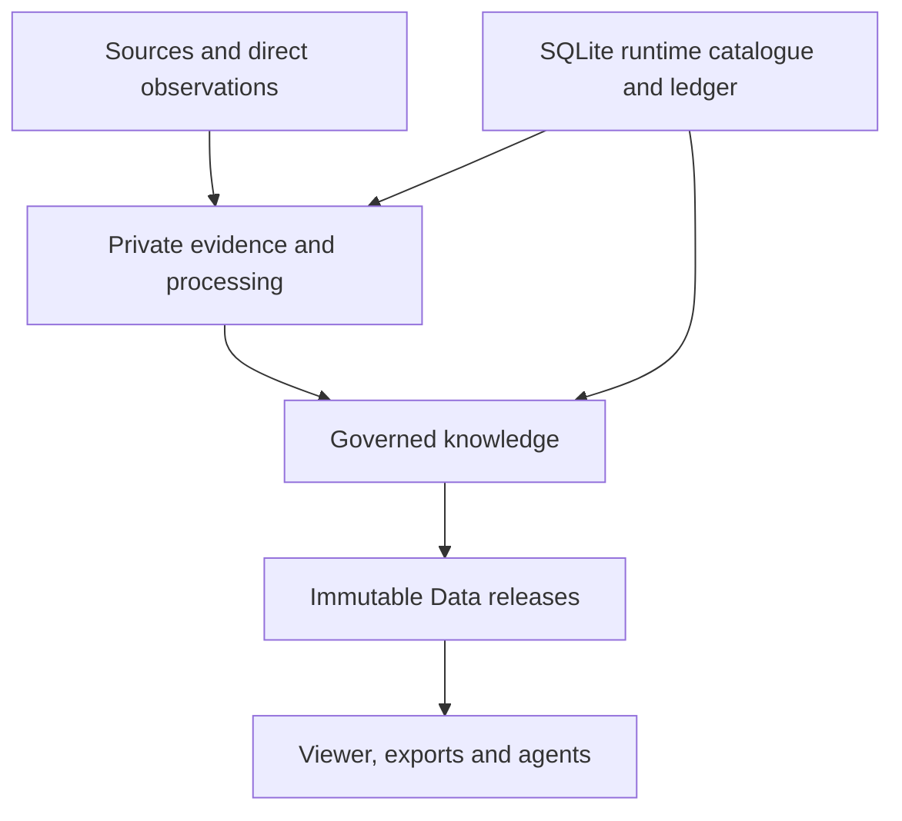

# CharityGraph integrated product and data model

**Status:** Canonical integrated design authority, version 1.0-draft

**Date:** 24 August 2026

**Applies to:** CharityGraph product requirements, Builder vNext conceptual model, taxonomy governance, private evidence and runtime architecture, public Data releases, Viewer projections, analyst exports and future agent interfaces

**Nature of this document:** Approved product and conceptual-data-model authority. It governs prospective Builder vNext design but does not amend the immutable public contract 0.5 or create a future public schema.

## 1. Executive conclusion

The eleven design contracts form a coherent product architecture. They do not reveal a need to retreat from the current CharityGraph direction. They do reveal that the product documentation and common semantic contract are now materially narrower than the domain model that has grown around them.

The required consolidation is chiefly ontological:

1. distinguish real-world subjects from information artefacts, knowledge statements, governed decisions, operational records and release objects;
2. introduce reusable shared primitives for scope, party roles, relationships, events, observations, measures, resource flows, commitments, matters, taxonomy assignments and publication;
3. make each domain a governed profile of those primitives rather than an independent mini-database;
4. assign one canonical owner to every cross-domain seam;
5. update the product documents so that their promises, user experiences, roadmap and tests match the Builder vNext observation-centred architecture; and
6. postpone the public vNext schema until the integrated conceptual model has been exercised against real evidence.

No fundamental product contradiction was found. The apparent conflicts are mostly:

- duplicated record families created during topic-by-topic design;
- a too-broad early list of `subject_type` values;
- inconsistent use of record, assertion, observation, event and relationship terminology;
- domain-specific measures that lack a common measurement envelope;
- public-product language that still sounds card-centred while the internal system is now observation- and assertion-centred; and
- implementation questions that were deliberately left open pending a reality spike.

The recommended target remains:

> **CharityGraph is the one-stop shop for structured, governed Australian charity data.**

“One-stop shop” means integrated coverage, stable discovery and explainable provenance across relevant charity-data domains. It does not mean that every field is available for every charity, that CharityGraph replaces every primary source, or that incompatible evidence is collapsed into one score or answer.

## 2. Authority, scope and compatibility

### 2.1 Inputs consolidated

This document reconciles:

1. the wide taxonomy and standards landscape;
2. the common semantic contract;
3. the entity, purpose, program, population and geography contract;
4. the participation contract;
5. the fundraising and resource-mobilisation contract;
6. the finance and resource-flow contract;
7. the ethos, conduct, commitments and notability contract;
8. the impact, outcomes, evidence and evaluation contract;
9. the governance, workforce, organisational capability and service-capacity contract;
10. the relationships, networks and ecosystem contract; and
11. the source, acquisition, provenance, adjudication and publication contract.

It also reconciles those contracts with the current product rewrite, top-level product-goals review, Builder target architecture and product–architecture alignment review.

### 2.2 Authority rule

Under `DOCUMENT_AUTHORITY.md`:

- approved public commitments and immutable release contracts remain authoritative for current public behaviour;
- implemented Builder runtime contracts remain authoritative for the behaviour they already specify;
- this document is the canonical conceptual authority for resolving overlaps among the eleven design contracts;
- the domain contracts remain research/design evidence for detail not yet incorporated into a governed profile; and
- historical material remains evidence, not active product authority.

### 2.3 Immutable v0.5 boundary

The existing v0.5 release is an immutable compatibility artefact. It SHALL NOT be rewritten to conform to this model.

This integrated model applies prospectively to Builder vNext and a future public release contract. A later release MAY project selected vNext knowledge into a card-shaped convenience view, but that card is not the internal knowledge model.

### 2.4 Naming boundary

Active product and design material SHALL use CharityGraph naming.

The integrated model uses:

- opaque internal `subject_id` and other technical record identifiers;
- authority-scoped external identifiers such as ABN, ACNC identifiers, source-system identifiers and scheme identifiers; and
- explicit identity and succession records.

It SHALL NOT create a public universal identifier merely by attaching the product name to a sequence, hash or source identifier. Historical compatibility identifiers, where technically unavoidable, belong only in isolated compatibility mappings and SHALL NOT appear as active product language.

## 3. Product contract

### 3.1 Product purpose

CharityGraph exists to reduce the cost, ambiguity and risk of understanding Australian charities, their programs, services, resources, relationships, operating context and evidence.

It creates value by making heterogeneous charity information:

- discoverable;
- structurally comparable where comparison is legitimate;
- source-faithful where normalisation would otherwise erase meaning;
- governed and contestable;
- historically traceable;
- reusable by analysts and software; and
- explicit about gaps, uncertainty, rights and limitations.

### 3.2 Anchor user

The analyst or consultant is the anchor user for product design.

This user needs to:

- construct cohorts;
- understand the supply of programs and services;
- compare operating models without false equivalence;
- trace funding and delivery relationships;
- investigate participation, fundraising, governance and capability;
- distinguish organisational claims from regulator facts and independent evidence;
- inspect changes over time;
- export governed data and provenance; and
- explain a conclusion to a client, funder, partner or decision-maker.

The analyst persona is an effective forcing function because it requires both breadth and epistemic discipline. A dataset adequate for serious analysis can also support simpler discovery and future agent use; the reverse is not necessarily true.

### 3.3 Other first-class users

| User | Principal need | Product implication |
|---|---|---|
| Funder or grantmaker | Discover eligible organisations and understand mandate, capability, relationships and evidence | Program-level scope, funding flows, mandate evidence and comparability controls |
| Government or service planner | Understand where need and supply exist and how delivery is organised | Service, site, catchment, capacity, availability, network and demand observations |
| Charity insider or adviser | Check and correct representation; benchmark carefully; understand ecosystem position | Contestability, source-native data, peer cohorts and non-punitive missingness |
| Researcher | Reproduce findings, inspect classifications and understand methodological decisions | Versioned taxonomies, evidence lineage, historical releases and decision registers |
| Public viewer | Find and understand a charity or program without navigating many specialist sources | Accessible current projections with plain-language provenance |
| Data builder | Reuse governed data and schemas | Stable distributions, identifiers, licences, checksums and machine-readable metadata |
| Personal or institutional agent | Evaluate explicit user rules using current, scoped evidence | Machine-readable authority, freshness, uncertainty, constraint and explanation metadata |

### 3.4 Product promise and limits

CharityGraph SHALL aim for national breadth across registered charities and progressively deeper coverage across programs, services and other lower-level subjects.

It SHALL NOT promise:

- complete enrichment for every subject;
- real-time accuracy for every source;
- a universal measure of charity quality, trust, impact, ethos or efficiency;
- personal financial advice, donation execution or an endorsement;
- a volunteer marketplace;
- a fundraising surveillance platform;
- a substitute for legal, accounting or regulatory advice; or
- automatic resolution of contested or value-laden questions.

### 3.5 Neutrality

CharityGraph neutrality is procedural, not an instruction to flatten evidence quality.

The product SHALL:

- distinguish authority-reported facts, first-party claims, independent reports, direct observations, calculations and modelled claims;
- apply claim-family rules consistently;
- preserve material contrary evidence and procedural states;
- expose reasons and limitations;
- avoid pay-to-rank or commercial editorial weighting; and
- permit users or agents to apply their own explicit mandates without converting those preferences into canonical CharityGraph judgments.

## 4. Integrated architecture

### 4.1 Architectural layers

The layers have different purposes:

| Layer | Primary contents | Governing rule |
|---|---|---|
| Sources | Registries, filings, reports, websites, directories, research, submissions and direct observations | Source use is claim-, scope-, rights- and time-specific |
| Private evidence | Retrieved artefacts, authorised representations, OCR, parsed structures and evidence spans | Preserve integrity, provenance, access restrictions and minimisation |
| Runtime control | Cohorts, runs, tasks, attempts, receipts, caches, budgets, costs and artefact indices | SQLite is operational state, not public truth |
| Candidate knowledge | Source assertions, observations, extracted candidates, mappings and derived proposals | Append-only and not automatically accepted |
| Governed knowledge | Accepted or edited records, decision events, conflicts, corrections and current-view selections | Exact lineage and policy-governed promotion |
| Public Data | Immutable release projections, schemas, metadata, checksums and public provenance | Publish only eligible knowledge in an explicit contract |
| Consumption | Viewer pages, analytical exports and future agent interfaces | Preserve scope, status, uncertainty and attribution |

### 4.2 Physical separation

Builder vNext SHALL maintain distinct physical zones for:

1. source code and tracked configuration;
2. private evidence archives;
3. runtime and cache state;
4. temporary working and staging files;
5. public Data releases; and
6. Viewer source and deployment output.

Private source bodies, protected prompts and responses, credentials, runtime databases, private absolute paths and unreviewed working artefacts SHALL NOT enter public Git history or release distributions.

### 4.3 Local-first operating model

The approved operating model is a local Python system with:

- deterministic retrieval, parsing, joins, validation and release construction where practical;
- NLP for entity recognition, classification, relevance screening and candidate extraction;
- bounded model-provider calls for difficult OCR, extraction, comparison, synthesis and writing;
- explicit provider, cache, cost and budget boundaries;
- SQLite for operational catalogue, lineage and ledger state; and
- file-based evidence and release artefacts.

PostgreSQL, distributed workers, hosted orchestration, API/MCP distribution and large-scale direct-observation infrastructure remain future options, not current requirements.

## 5. Ontological layers

The most important consolidation is to stop treating every identifiable record as the same ontological kind.

### 5.1 Layer A — real-world subjects and reference entities

These are things about which CharityGraph may make claims:

- legal entity;
- operating organisation;
- organisational unit;
- person, subject to approved public-interest scope;
- position or office;
- program;
- service;
- project;
- campaign;
- appeal;
- participation opportunity;
- creative;
- placement;
- facility, asset or service site;
- governing body, committee or coalition;
- fund;
- place or geographic area;
- community, constituency or population represented through governed concepts; and
- external scheme, standard, code or authority.

These receive opaque internal identifiers when identity across records must be maintained.

### 5.2 Layer B — occurrences and economic objects

These are time-bounded real-world occurrences or reified objects:

- event;
- activity or intervention episode;
- participation episode;
- solicitation or encounter;
- appointment;
- grant award;
- contract;
- commitment;
- transaction or resource-transfer stage;
- complaint, investigation, proceeding, finding, sanction or remediation event;
- acquisition event;
- observation event; and
- publication event.

They may themselves be referenced by later assertions, but they are not organisational identity nodes.

### 5.3 Layer C — information artefacts and authored structures

These include:

- evidence artefact;
- document and document component;
- financial reporting package, statement, note and line item;
- theory of change and logic model;
- evaluation study and report;
- indicator definition;
- source snapshot;
- dataset and distribution;
- taxonomy, taxonomy release and concept; and
- public release and manifest.

An information artefact has identity, authorship, version and rights. Its contents are not automatically endorsed by CharityGraph.

### 5.4 Layer D — knowledge records

These represent what a source, observer, process or CharityGraph says:

- source assertion;
- observation;
- candidate assertion;
- taxonomy assignment or mapping;
- measurement observation;
- relationship statement;
- quality observation;
- derived assertion;
- synthesis;
- conflict case; and
- selected-view assertion.

Every knowledge record carries provenance, scope, time, method and lifecycle.

### 5.5 Layer E — governance records

These control how knowledge changes status:

- identity decision;
- review or adjudication decision;
- acceptance, edit, rejection, supersession or withdrawal event;
- correction or challenge;
- publication-eligibility decision;
- source-use decision;
- taxonomy disposition;
- privacy, rights or Indigenous-governance decision;
- selection-policy decision; and
- emergency withdrawal decision.

Governance records are evidence-bearing records, not invisible edits.

### 5.6 Layer F — operational records

These include:

- cohort;
- run;
- task;
- attempt;
- operation receipt;
- budget reservation;
- cost entry;
- cache event;
- transformation activity;
- validation result; and
- artefact index entry.

Operational success does not imply knowledge acceptance or publication.

### 5.7 Layer G — public projections

Public records are release-specific representations of eligible governed knowledge:

- organisation card;
- program or service card;
- domain summary;
- assertion history or evidence card;
- relationship graph projection;
- analyst table or graph export;
- taxonomy distribution;
- correction record;
- release catalogue record; and
- agent-oriented decision bundle.

The public projection may denormalise for usability, but it SHALL preserve links to the governed basis of each material field.

## 6. Common semantic envelope

Every substantive knowledge record SHALL use or reference a common envelope.

### 6.1 Identity

- stable record identifier;
- record type;
- schema/profile identifier and version;
- subject, object and other party identifiers as required;
- source-native record identifiers; and
- identity-resolution state.

### 6.2 Scope

- subject scope;
- organisational, program, service, campaign, site, reporting-group or other functional scope;
- population scope;
- geographic scope and role;
- temporal scope;
- jurisdiction;
- source coverage scope; and
- material qualifiers required by the predicate.

### 6.3 Provenance

- claimant or asserting party;
- publisher, source, host and custodian roles;
- processor;
- observer;
- reviewer and decision-maker;
- evidence links and evidence spans;
- production method;
- transformation and model metadata where applicable; and
- directed lineage.

### 6.4 Epistemic state

- source authority for the claim family;
- evidence strength or sufficiency;
- extraction, identity and mapping confidence as separate dimensions;
- assertion method;
- lifecycle state;
- dispute or conflict status;
- missingness or absence state; and
- limitations.

### 6.5 Time

- valid-from and valid-to;
- event time;
- observation time;
- source publication time;
- retrieval time;
- recording time;
- decision time; and
- public release time.

Fields MAY share a value when the underlying times coincide, but the concepts SHALL remain separable.

### 6.6 Governance and publication

- review policy and review state;
- acceptance/edit/rejection lineage;
- privacy and sensitivity class;
- rights and attribution state;
- publication eligibility;
- redaction or aggregation requirements;
- correction status; and
- release inclusion lineage.

## 7. Shared primitives

### 7.1 Party and party role

A `party` is an entity that participates in a relationship, event, claim, transaction or decision. A `party_role` states the capacity in which it participates.

Examples include:

- claimant;
- publisher;
- regulator;
- funder;
- payer;
- donor;
- commissioner;
- recipient;
- grantee;
- contractor;
- implementing partner;
- employer;
- volunteer host;
- participant group;
- evaluator;
- assurer;
- reviewer; and
- decision-maker.

Party roles are contextual. A legal entity is not intrinsically a funder or provider; it holds that role in a defined record.

### 7.2 Scope

A reusable `scope` primitive SHALL describe where a claim applies.

It MAY reference:

- a legal entity or reporting group;
- an organisation or unit;
- a program, service, project, campaign or appeal;
- a site, facility or placement;
- a population or stakeholder role;
- a place or geographic area;
- a period or point in time;
- a jurisdiction;
- a fund, contract or grant; and
- a source denominator or processing cohort.

Scope is not free text alone. It is the principal defence against accidental organisation-wide propagation.

### 7.3 Qualified relationship

A `relationship_statement` is a time-bounded, directed, typed and evidenced statement connecting two parties or subjects.

It SHALL carry:

- endpoint identities and roles;
- canonical direction and inverse-display rule;
- relationship type and source-native label;
- scope, validity and status;
- direct, indirect or derived state;
- intermediary path where relevant;
- establishing or ending events;
- evidence, authority and method;
- conflict and review state; and
- publication controls.

Appointments, memberships, affiliations, delivery partnerships, control, funding relationships, scheme participation and participation relationships SHALL profile this primitive rather than invent independent unlinked edge stores.

### 7.4 Event

An `event` is a bounded occurrence with participants, roles, type, place, time, scope and evidence.

Event profiles include:

- registration change;
- merger, split or succession;
- appointment or cessation;
- participation episode;
- fundraising encounter;
- grant award or payment;
- service delivery episode;
- complaint, proceeding, finding or sanction;
- direct observation; and
- correction or publication action.

An event does not imply an enduring relationship. An enduring relationship may be supported by one or more events.

### 7.5 Observation

An `observation` records what a source, observer, instrument or process encountered within a bounded method, place and time.

Observation profiles include:

- source-field observation;
- website-state observation;
- direct fundraising observation;
- service availability observation;
- workforce observation;
- capacity observation;
- indicator observation;
- participation episode observation; and
- quality observation.

An observation MAY contain a structured value. It does not automatically establish permanence, intent, causation, typicality or entity-wide scope.

### 7.6 Measure and measurement

A common `measure_definition` SHALL define:

- concept measured;
- unit;
- numerator and denominator where applicable;
- population and inclusion rules;
- counting or valuation method;
- direction and interpretation;
- disaggregation dimensions;
- comparability constraints;
- version; and
- external mappings.

A common `measurement_observation` SHALL define:

- measure version;
- value or value distribution;
- subject and scope;
- period or date;
- method and source;
- sample, denominator or coverage where relevant;
- uncertainty;
- missingness and suppression;
- reported, estimated, calculated, forecast or target state;
- revision state; and
- provenance.

Finance amounts, workforce counts, participation measures, service capacity, fundraising measures, outputs, outcomes and network metrics SHALL profile this primitive.

### 7.7 Activity and intervention

An `activity` describes what an actor does. An `intervention` is an activity or coordinated set of activities intended to affect a population, condition or system.

The model SHALL keep separate:

- legal purpose;
- stated mandate;
- subject or cause;
- operational activity;
- intervention mechanism;
- support or funded-use category;
- output;
- outcome; and
- goal alignment.

This prevents a legal classification, funding category or SDG mapping from masquerading as observed operations.

### 7.8 Resource commitment and flow

A `resource_commitment` represents an obligation, pledge, award, order or undertaking concerning money, goods, rights, services, time or another resource.

A `resource_flow` represents a stage in actual or reported movement or use of a resource.

It SHALL support:

- originating, intermediary and ultimate parties where evidenced;
- party roles;
- resource type;
- instrument;
- commitment, receipt, disbursement, expenditure, payment, return or refund stage;
- amount or quantity and valuation basis;
- restriction or performance obligation;
- program, campaign, fund, geography and period scope;
- source observations; and
- links between multiple reports of the same underlying flow.

Donations, grants, contracts, sponsorship, fundraising transfers, in-kind contributions, pro bono work and volunteer time MAY use this primitive. They remain different legal and economic phenomena.

### 7.9 Commitment, obligation and implementation

A `commitment` records a pledge, policy, target, code obligation, contractual duty, statutory requirement or order.

It SHALL remain separate from:

- membership in the issuing scheme;
- claimed implementation;
- observed practice;
- verified compliance;
- outcome; and
- current legal status.

Status and strength vocabularies are domain profiles. A public statement does not become a binding commitment merely because it uses aspirational language.

### 7.10 Matter and procedural record

A `matter` groups claims and events concerning the same underlying issue without declaring that every component is true.

Its components MAY include:

- complaint or allegation;
- referral;
- investigation;
- proceeding;
- finding or decision;
- sanction, order or undertaking;
- appeal or review;
- response;
- remediation; and
- closure or current-status record.

Procedural status SHALL be preserved. Allegation, investigation, finding and sanction are not interchangeable.

### 7.11 Scheme participation

`scheme_participation` SHALL be a qualified relationship between a subject and a scheme, code, registry, certification, accreditation or licensing body.

It SHALL record:

- participation type;
- identifier;
- scope;
- start, expiry and status;
- governing version or instrument;
- evidence and source authority;
- self-declared, authority-reported or derived state; and
- any certification or verification result as a separate linked record.

This primitive supports fundraising shadow registries, professional and service accreditations, codes of conduct and voluntary commitments without treating membership as whole-organisation endorsement.

### 7.12 Taxonomy assignment and mapping

A `taxonomy_assignment` records that a source or CharityGraph assigns a concept to a subject or record.

A `taxonomy_mapping` records a directional relationship between concepts or assignments.

They SHALL retain:

- taxonomy and release;
- concept identifier;
- assigning source or mapping authority;
- assignment or mapping method;
- scope and time;
- exact, close, broader, narrower, related, conditional, no-match or not-reviewed relation;
- confidence and review state; and
- evidence and lineage.

Source assignments and CharityGraph mappings SHALL remain different records.

### 7.13 Coverage and absence

A `coverage_observation` describes what was eligible, available, acquired, processed, successfully extracted, reviewed and published.

Absence states SHALL distinguish:

- asserted none;
- observed absent;
- not found;
- source silent;
- source unavailable;
- not acquired;
- not processed;
- processing failed;
- not reviewed;
- not applicable;
- withheld;
- stale; and
- unknown.

A negative public statement requires an applicable coverage observation. Missingness SHALL NOT silently become false.

### 7.14 Correction and challenge

A `challenge` records a request to review identity, evidence, interpretation, privacy, rights or publication.

A `correction_decision` records the outcome and SHALL link:

- challenged record;
- supplied evidence;
- interim action;
- reviewer and authority;
- decision and rationale;
- replacement, annotation, withdrawal or no-change result;
- appeal or review path; and
- affected future releases.

Immutable releases remain immutable. Emergency removal of protected material may make a distribution unavailable, but the public catalogue SHOULD preserve safe metadata and the reason for withdrawal.

## 8. Identity and subject model

### 8.1 Identity stack

The canonical stack is:

1. **Legal entity:** a body recognised by an applicable legal or registry regime.
2. **Operating organisation:** a coherent operating identity that may persist across legal changes or involve several legal entities.
3. **Organisational unit:** branch, division, chapter, auspiced initiative or controlled unit.
4. **Program:** a governed body of work pursuing defined purposes or outcomes.
5. **Service:** a repeatable offer available to eligible users or participants.
6. **Project:** bounded work with a period or deliverable.
7. **Campaign or appeal:** coordinated advocacy, awareness, fundraising or mobilisation effort.
8. **Site, facility or placement:** a location or channel-specific manifestation.

These are connected by governed relationships, not hard-coded parent columns alone.

### 8.2 Node-creation test

A distinct subject SHOULD be created when at least one of the following is material:

- it has a source-native identifier;
- claims apply to it but not its parent;
- it has independent time, geography, population, governance, funding or evidence;
- it participates in relationships in its own right;
- it can persist, cease, merge or change independently; or
- analysts need to prevent attributes from propagating to a broader subject.

The system SHOULD avoid creating artificial subjects for every paragraph, web page or category label.

### 8.3 External identifiers

ABN, ACNC, ASIC, ORIC, Wikidata, service-directory, program, grant, contract and scheme identifiers are authority-scoped identifier records.

They SHALL NOT be treated as globally interchangeable. Identity matches preserve:

- scheme;
- value;
- issuer;
- validity;
- status;
- match method;
- evidence;
- reviewer or rule; and
- confidence.

### 8.4 Succession and continuity

Rename, merger, split, transfer, change of legal vehicle, auspice transition and program succession SHALL be represented through events and relationships.

Internal identifiers SHOULD remain stable only while the intended real-world identity remains coherent. A merge or split SHALL NOT be hidden by silently reusing one node.

### 8.5 Person records

Person identity is permitted only for a defined public-interest purpose, such as a publicly listed responsible person, office holder, author, evaluator, auditor or decision-maker.

The public product SHALL minimise personal information and SHALL NOT publish participant-, donor-, frontline-worker-, complainant- or beneficiary-level records merely because the internal system encountered them.

## 9. Domain ownership

Each domain owns specialised vocabulary and validation. Shared primitives own the envelope and cross-domain semantics.

| Domain | Canonical ownership | Uses shared primitives |
|---|---|---|
| Entity, purpose, program, population and geography | Subject identity stack; legal purpose; mandate; subject/cause; activity/intervention; program/service boundary; population roles; geography roles | Party, scope, relationship, taxonomy assignment, observation, coverage |
| Participation | Opportunity, participation-role, function, influence, setting and time-pattern vocabularies | Relationship, event, observation, measurement, population, skill, access condition |
| Fundraising | Strategy, solicitation mechanism, channel, setting, resource sought, instrument, delivery role and compensation vocabularies | Campaign, appeal, creative, placement, event, observation, commitment, resource flow, measure, scheme participation |
| Finance | Reporting instance, source statements and lines, finance concepts, accounting mappings, assurance, funds, allocations and calculations | Measure, resource flow, relationship, evidence, period/scope, taxonomy mapping |
| Ethos, conduct, commitments and notability | Ethos, position, procedural-state, adverse-matter, remediation, notability-signal and mandate-rule profiles | Assertion, commitment, matter, event, relationship, scheme participation, correction |
| Impact, outcomes, evidence and evaluation | Need, theory of change, result, indicator, study, finding, evidence-design and causal-language profiles | Activity, measure, observation, relationship, evidence, taxonomy mapping, quality |
| Governance, workforce, capability and capacity | Governance structures, positions, appointments, workforce roles, capabilities, credentials, service offers, capacity layers and access conditions | Relationship, observation, measure, scheme participation, site, population, event |
| Relationships, networks and ecosystems | Relationship type registry, endpoint constraints, group structures, graph projections and network-method governance | Party, scope, event, resource flow, identity, measure |
| Source-to-publication | Source registry, acquisition, artefact, transformation, adjudication, rights, quality, runtime, release and correction machinery | Every knowledge and publication record |

### 9.1 Ownership rule

When two domains refer to the same underlying thing:

- the shared primitive defines record identity and generic semantics;
- the domain profile supplies specialised concepts and validation;
- a link joins the profiles; and
- duplicate records are created only when they represent genuinely different source assertions or observations.

## 10. Cross-domain seam matrix

| Seam | Correct integrated treatment | Prohibited shortcut |
|---|---|---|
| Legal purpose ↔ operational activity | Separate assertions linked through subject and program scope | Inferring current operations from registration subtype |
| Program ↔ service | Separate subjects connected by `offers` or equivalent qualified relationship | Treating every program name as a service or vice versa |
| Population ↔ participant | Population role states intended, eligible, reached, represented or observed; participation records state contribution roles | Treating beneficiaries as volunteers or members without evidence |
| Participant ↔ workforce | Shared contribution/employment relationship with domain role profile | Double counting the same person or hours across volunteer and workforce measures |
| Participation ↔ fundraising | Fundraising role, episode or opportunity profiles participation; donation remains a resource flow | Treating every donor as a volunteer or every fundraiser as an employee |
| Fundraising ↔ finance | Campaign/appeal activity links to reported fundraising lines and transfers | Treating campaign claims as audited revenue or accounting totals as channel evidence |
| Grant ↔ contract ↔ donation | Shared commitment/flow envelope with distinct instruments, obligations and party roles | Collapsing all inflows into donations |
| Flow ↔ relationship | A flow may evidence or occur within a relationship; it does not automatically establish a durable relationship | Turning each payment into a permanent edge |
| Governance ↔ participation | Appointments and member governance use qualified relationships with participation profiles | Treating board membership as generic volunteering only |
| Governance ↔ ethos | Policies and commitments are evidence; implementation and conduct require separate observations | Inferring practice from policy publication |
| Accreditation ↔ capability | Scheme status can evidence authorised scope; actual capability, availability and quality remain separate | Treating accreditation as proof of spare capacity or outcomes |
| Capability ↔ capacity ↔ availability | Separate capability profile and time-bound measures for capacity and availability | Treating licence scope or designed places as available service |
| Need ↔ demand ↔ waitlist | Separate contextual need, expressed demand, referrals, waitlist and unmet-demand estimate | Equating a waitlist with total demand |
| Output ↔ outcome ↔ impact | Separate result types, indicators and causal evidence | Relabelling activity volume as impact |
| Outcome ↔ social value | Outcome quantity links to valuation and economic-evaluation assumptions | Treating modelled social value as cash, revenue or audited return |
| Ethos ↔ mandate fit | Canonical evidence remains neutral; user-owned rules produce explainable evaluations | Publishing a universal values or virtue score |
| Notability ↔ quality | Notability signals support context and discovery only | Penalising small charities for little media or Wikipedia coverage |
| Relationship ↔ association | Qualified, evidenced relationship with roles and scope | Inferring control, endorsement or shared ethos from co-occurrence |
| Direct observation ↔ enduring fact | Observation establishes only the bounded encounter; repeated evidence may support a later assertion | Inferring an organisation-wide continuous practice from one sighting |
| Source record ↔ real-world identity | Preserve source record and adjudicated identity link separately | Deduplicating similar names into one subject automatically |
| Accepted knowledge ↔ public data | Publication eligibility is a separate decision | Publishing every accepted internal record |

## 11. Integrated domain model

### 11.1 Entity, purpose, programs, populations and geography

The entity domain provides the spine of the product.

CharityGraph SHALL:

- retain legal entities as registry anchors;
- represent operating organisations separately where evidence supports the distinction;
- create program and service subjects from the first vNext build where source evidence permits;
- preserve legal purpose, current mandate, subject/cause, operational activity, support use, output, outcome and goal alignment separately;
- model population involvement through typed roles;
- distinguish intended, eligible, reached, represented, participating and merely mentioned populations;
- support non-human and place-based affected parties;
- treat geography as role-bearing and versioned; and
- derive organisation portfolio views from lower-level evidence rather than naive tag union.

### 11.2 Participation

Participation is the umbrella domain for contributing time, skill, voice, membership, governance or lived experience.

Its four public analytical forms are:

1. opportunity;
2. relationship or role structure;
3. bounded episode or observation; and
4. aggregate measure.

Volunteering is one participation relationship. Membership, governance, co-design, consultation and lived-experience contribution remain first-class.

The initial public system SHALL remain a structured-data and discovery product, not a matching marketplace. Participant-level personal data remains outside public scope except for separately governed public office-holder facts.

### 11.3 Fundraising and resource mobilisation

Fundraising uses a native multi-axis vocabulary because no located scheme provides the required combined coverage.

The axes SHALL include:

- strategy;
- solicitation mechanism;
- communication channel;
- physical or digital setting;
- resource sought;
- donor or funder relationship stage;
- commitment pattern;
- transfer or payment instrument;
- delivery party; and
- compensation model.

Campaign, appeal, creative, placement, encounter, commitment and transfer remain separate linked objects.

The scheme SHALL distinguish, among other things:

- residential door-knocking;
- street or public-place face-to-face fundraising;
- shopping-centre or other private-site face-to-face fundraising;
- charity-shop goods drop-off;
- unattended donation bin;
- organised pick-up or collection;
- goods drive;
- out-of-home formats;
- television and digital video; and
- future directly observed placements and encounters.

Large-scale observation collection is deferred, but the schema supports it now.

### 11.4 Finance and resource flows

Finance maintains two linked layers:

1. source-faithful statements, lines, notes, assurance and reporting scope; and
2. normalised analytical concepts, mappings, calculations and flows.

Every financial amount SHALL retain reporting instance, scope, period, currency, scale, accounting basis, source location and revision context.

Program-level finance is permitted only when directly reported or allocated by a documented method. Calculations are CharityGraph-derived assertions and do not inherit the assurance status of their inputs.

The product SHALL support descriptive analysis but SHALL not initially publish a composite financial score or rank organisations by simplistic administration or program-cost ratios.

### 11.5 Ethos, conduct, commitments and notability

This domain keeps separate:

- purpose;
- ethos or values;
- policy position;
- commitment;
- claimed or observed implementation;
- conduct;
- regulatory status;
- procedural matter; and
- notability signal.

Adverse information follows a formal lifecycle from complaint or allegation through investigation, finding, sanction, response, remediation and appeal. Exoneration, dismissal, withdrawal, expiry, variation and overturning receive equal structural care.

Notability is descriptive attention or historical significance, not merit, legitimacy, impact or eligibility. It SHALL not control coverage or default ranking.

Agentic mandate evaluation belongs in an explicit user-rule layer. Results may be `allow`, `exclude`, `prefer`, `review` or `insufficient_evidence` as defined by the rule profile; they do not alter canonical evidence.

### 11.6 Impact, outcomes, evidence and evaluation

CharityGraph SHALL distinguish:

- need and context;
- theory of change;
- input;
- activity or intervention;
- output;
- outcome;
- impact;
- indicator;
- observed result;
- evaluative finding;
- causal claim; and
- economic or social-value model.

Change, contribution and causation remain different claim strengths. Null, mixed, negative and inconclusive findings are first-class.

The product SHALL preserve evidence design, instrument, denominator, sample, comparator, uncertainty, independence, limitations and cultural-governance context. Qualitative evidence is not treated as an inferior quantitative estimate.

### 11.7 Governance, workforce, capability and capacity

The governance model distinguishes legal governance, operational management, service or clinical governance, community authority and stakeholder participation.

Persons, positions and appointments are separate. Responsible-person registers do not constitute a complete management or control graph.

Workforce measures distinguish people, jobs, headcount, full-time equivalent labour and hours, along with employment, contracting, labour-hire, volunteering, membership, placement and partner-personnel relationships.

Capability, capacity, availability, activity, output and outcome remain separate. Capacity layers include design, approved, funded, staffed, operational, available, occupied and delivered states.

Service records SHALL preserve access conditions, eligibility, referral pathways, intake state, hours, fees, accessibility, catchment, delivery location and actual reach separately.

### 11.8 Relationships, networks and ecosystems

All substantive relationships are qualified records, not bare graph edges.

The model supports:

- legal and accounting control;
- group, federation, branch and chapter structures;
- auspicing and fiscal sponsorship;
- funding, grant and contract roles;
- implementation and delivery relationships;
- referral and service ecosystems;
- scheme membership and codes;
- assurance, research and knowledge relationships;
- assets, property, technology and shared brands;
- coalitions and advocacy; and
- related-party relationships and transactions.

Network measures are transparent derivations from an explicit graph projection. Centrality is not importance, apparent isolation may reflect missing data, and link prediction remains hypothesis generation rather than published fact.

### 11.9 Source-to-publication governance

Every recurring source receives a source profile, rights assessment, claim-authority matrix, acquisition plan and lifecycle state.

Every published assertion SHALL be traceable through:

1. source or direct observation;
2. acquisition receipt;
3. retained evidence or authorised evidentiary representation;
4. parsing, OCR or transformation;
5. candidate assertion or record;
6. governed decision;
7. canonical governed record;
8. publication-eligibility decision; and
9. immutable release projection.

Model output is never source evidence. A cache is never governed knowledge. A successful run is never publication approval.

## 12. Taxonomy architecture

### 12.1 Multi-facet system

CharityGraph SHALL not seek one taxonomy to classify charities universally.

The governed facet system includes:

- legal and regulatory status;
- purpose and mandate;
- subject or cause;
- population and stakeholder role;
- operational activity or intervention;
- program and service form;
- participation relationship and function;
- fundraising strategy, mechanism, channel, setting, resource and instrument;
- finance and resource-flow concepts;
- governance, workforce, skill, capability and capacity;
- ethos, position, commitment, conduct and notability;
- output, outcome, evidence and evaluation;
- geography;
- relationship type; and
- UN Sustainable Development Goal alignment.

### 12.2 Approved scheme dispositions

| Scheme or family | Integrated disposition |
|---|---|
| ACNC classifications and reported fields | Retain as versioned authority-reported facts within scope |
| ATO/DGR classifications and gift types | Retain as tax-authority concepts; do not redefine donation or cause broadly |
| CLASSIE | Optional external Subject/Population scheme, deferred pending rights/permission; profile support-use/activity facets only when permitted |
| National Standard Chart of Accounts | Adopt as the principal Australian not-for-profit finance interoperability reference; preserve source accounts and mappings |
| UN Sustainable Development Goals | Adopt now as a goal-alignment overlay; targets require evidence; indicators require their own measurement evidence |
| ABS geography | Adopt ASGS identifiers with explicit edition and role |
| ABS occupation and statistical classifications | Crosswalk where semantically appropriate; do not treat as complete domain taxonomies |
| ACNC historical activity/ICNPO | Preserve source assignments and historical comparability |
| Open Referral HSDS | Profile as service-schema/interchange reference, not controlling ontology |
| Volunteering Australia and ILO volunteering definitions | Align/profile participation boundaries and organisation-based/direct distinction |
| FIA, PFRA and other industry shadow registries | Treat as first-class scoped sources for membership, status and governed conduct evidence |
| Australian evaluation frameworks and guidance | Profile methods, criteria and governance; do not force one universal outcome taxonomy |
| IATI, 360Giving and Open Contracting | Profile for role-rich grants, contracts, activities and results interoperability |
| W3C provenance, catalogue and quality vocabularies | Profile for provenance, public catalogue and quality interoperability |
| CharityGraph-native vocabularies | Develop where no external scheme provides adequate semantics, especially participation, fundraising and operational intervention |

### 12.3 Governance record

Every external or native scheme SHALL have a public decision record containing:

- semantic job;
- steward and authority;
- jurisdiction and intended use;
- release/version policy;
- access, licence, attribution and mark-use constraints;
- CharityGraph disposition;
- incorporated concepts or crosswalks;
- known gaps and distortions;
- implementation status;
- review owner;
- revisit trigger; and
- research sources.

Disposition values are:

- adopt;
- profile;
- incorporate;
- crosswalk;
- adapt;
- reference only;
- defer;
- reject; and
- supersede.

## 13. Authority, confidence and current views

### 13.1 Claim-specific authority

Source authority SHALL be declared by claim family, scope, jurisdiction and period.

Examples:

| Claim | Typical high-authority source | Important limitation |
|---|---|---|
| Registration status | Statutory charity register | Does not establish current program activity |
| DGR status | Tax authority | Does not establish broad merit or mandate fit |
| Filed financial amount | Regulator filing or assured financial statement | Definitions, consolidation and period still matter |
| Stated strategy or position | Governing document or authorised first-party publication | Establishes statement, not implementation or outcome |
| Scheme membership | Scheme operator registry | Applies only to the scheme, scope and current period |
| Service approval | Relevant regulator or official register | Does not prove current availability or quality |
| Program outcome | Evaluation or appropriately designed evidence | Evidence design and population determine claim ceiling |
| Direct placement occurrence | Well-evidenced observation | Establishes only the bounded occurrence |

### 13.2 Separate epistemic dimensions

CharityGraph SHALL keep separate:

1. source authority;
2. evidence strength and directness;
3. processing confidence;
4. identity-match confidence;
5. taxonomy-mapping confidence;
6. temporal confidence;
7. review state; and
8. publication eligibility.

These SHALL NOT be collapsed into one truth, trust, quality or confidence score.

### 13.3 Current views

“Current” is the result of a versioned selection policy evaluated at a stated time.

A current view SHALL:

- identify candidate governed assertions;
- apply claim-specific scope, status, authority and recency rules;
- preserve non-selected and conflicting records;
- permit no selected value where ambiguity is material; and
- be reproducible for a release.

### 13.4 Useful judgment under ordinary uncertainty

CharityGraph SHALL distinguish uncertainty from paralysis.

For low-risk interpretive tasks such as cause, population, activity and UN Sustainable Development Goal assignment, an approved model is expected to make the best-supported classification when relevant evidence exists. The possibility that a reasonable person could prefer an adjacent concept is not sufficient reason to return `unknown` or require human review.

For these tasks:

- `unknown` means that relevant evidence was unavailable, unprocessable or genuinely insufficient to support a useful classification;
- ordinary boundary ambiguity SHOULD produce a primary assignment, optional secondary assignments, confidence, evidence links and a concise rationale;
- the assignment SHALL be identified as CharityGraph- or model-assessed rather than source-reported;
- automated promotion MAY occur under an evaluated claim-family policy; and
- sampling, challenges and later correction provide quality control.

Durable concept-to-concept declarations such as `exact_match` remain more demanding than instance classification. Human or governed review may be required to assert that two external concepts are semantically interchangeable; it is not required merely to classify a program against existing concepts.

## 14. Adjudication and lifecycle

### 14.1 Knowledge path

The integrated lifecycle is:

1. evidence or bounded observation;
2. source-native record;
3. candidate assertion or structured proposal;
4. accepted, edited, rejected, withdrawn or review-required decision;
5. governed record;
6. selected current view where applicable;
7. publication-eligibility decision; and
8. release projection.

### 14.2 Exact continuity

Exact acceptance SHALL preserve the candidate’s material semantic content and link it to the promoted record.

Any material change SHALL create an edited record with directed lineage through the review decision. It SHALL NOT be labelled as exact acceptance.

### 14.3 Append-only semantics

Observations, assertions, decisions, corrections, cost entries, release records and lineage events are append-only.

Mutable convenience status MAY be maintained for operational performance only when the authoritative event history remains reconstructible.

### 14.4 Automated promotion

Automated promotion is permitted only for a defined low-risk claim family under a versioned policy with:

- deterministic task identity;
- retained or citable evidence;
- representative evaluation;
- calibrated thresholds;
- failure and bias analysis;
- exact lineage;
- correction and rollback procedures; and
- publication-risk controls.

Identity ambiguity, adverse matters, sensitive populations, inferred ethos, exact crosswalks, causal claims and material novel synthesis require human or specially governed review by default.

### 14.5 Open correction and community curation

A challenge is not evidence that publication should have been deferred until unanimity. CharityGraph SHALL publish useful governed judgments at meaningful scale, make their basis inspectable and convert community scrutiny into durable improvement.

Community contributors MAY propose corrections, mappings, new evidence, source updates and qualifications. They SHALL NOT mutate canonical records directly. Governed review may accept, edit, partially accept, uphold, defer or reject a proposal. Every outcome preserves evidence, rationale and lineage, and an accepted correction appears prospectively in a later release.

Successful correction is a product outcome. Evaluation SHALL distinguish ordinary contestable judgment, changed source evidence, taxonomy evolution and systematic processing error.

## 15. Privacy, rights, cultural governance and safety

### 15.1 Public availability is not reuse permission

CharityGraph SHALL assess separately:

- access permission;
- copyright and database rights;
- content licence;
- contractual terms;
- privacy;
- confidentiality;
- ethical collection;
- Indigenous data governance;
- public-interest basis; and
- downstream publication rights.

### 15.2 Aggregate-first public data

Public Data SHALL normally avoid person-level records for donors, beneficiaries, participants, volunteers, frontline workers, complainants and directly observed members of the public.

Workforce, participation, exposure, capacity and outcome data SHOULD be aggregated and suppressed where small cells or contextual detail create re-identification or safety risks.

### 15.3 Protected places and relationships

Precise locations and relationships involving refuges, survivors, whistleblowers, children, informal carers, culturally sensitive sites or small communities require restricted handling and coarser public projection.

### 15.4 Indigenous data governance

Where First Nations people, communities, knowledge, organisations, places or data are implicated, collection and use SHALL consider community authority, benefit, cultural safety, access control, interpretation and appropriate attribution. Open-data defaults SHALL not override these obligations.

### 15.5 Right-tail protection

Coverage, notability, governance and quality methods SHALL be tested for bias against small, local, volunteer-led, culturally specific, seasonal and lightly documented organisations.

Lack of a sophisticated website, detailed annual report, Wikipedia article, large board biography set or abundant digital footprint SHALL NOT be treated as evidence of poor quality, illegitimacy or inactivity.

## 16. Model-assisted processing and economics

### 16.1 Mechanical first

Use deterministic retrieval, parsing, joins, validation and known mappings when they are adequate.

Models MAY be used for:

- difficult OCR;
- structure recovery;
- entity and span recognition;
- relevance screening;
- candidate extraction;
- taxonomy suggestions;
- conflict comparison;
- synthesis drafts; and
- public writing derived from governed assertions.

Models SHALL NOT manufacture missing evidence, infer protected attributes without policy, or silently promote claims outside evaluated boundaries.

“Mechanical first” is a method-selection rule, not an instruction to reproduce language understanding with expanding Python heuristics. Deterministic code handles stable syntax and exact rules. Models handle bounded semantic judgment. Human review handles high-consequence ambiguity. The system may abstain when evidence is genuinely insufficient.

### 16.2 Provider boundary

Every model task and result SHALL retain task identity, provider, model, parameters, prompt/template version, input artefacts, receipt, cost and time.

Provider outputs remain proposals or computational artefacts. The CharityGraph knowledge lifecycle determines whether any proposed content becomes governed knowledge.

### 16.3 Cohort economics

The Builder SHALL use cohort-level planning, reservations, actual costs, credits and reconciliation. The approved initial scheduled LLM allocations are:

| Processing cohort | Scheduled allocation | Approximate intensity |
|---|---:|---:|
| First 100 charities | AU$100 | AU$1 per charity |
| Next 1,000 charities | AU$100 | AU$0.10 per charity |
| Next 10,000 charities | AU$100 | AU$0.01 per charity |
| Remaining national tail | No routine per-charity allocation initially | Registry baseline, deterministic, cached, opportunistic or demand-triggered enrichment |

Cohort membership is a processing decision, not a judgment of charitable merit. Claim-family risk can override cohort intensity. A lower-cohort charity may receive deeper processing because of a user request, correction, identity ambiguity, public scrutiny, sensitive claim, material flow or downstream decision consequence.

Evaluation SHALL measure:

- cost per acquired and processed subject;
- cost per usable candidate;
- cost per accepted or published assertion;
- cache benefit;
- retry and failure cost;
- human review burden;
- domain and right-tail error distribution; and
- marginal value of added model depth.

The system SHOULD spend model budget where ambiguity, utility or consequence warrants it, not merely because a model call is available.

CharityGraph explicitly prefers useful coverage and national reach over uniform forensic depth. It maintains a universal inexpensive provenance floor while tiering expensive source breadth, field-level evidence spans, corroboration, repeated model passes and human review.

Every published model-assessed assertion SHALL retain or resolve to content-addressed source inputs, source and retrieval metadata, exact or reconstructable prompt, prompt and policy version, provider and model, relevant parameters, structured result, task/run identity, time, cost, validation and release lineage. Exact release reproducibility remains mandatory even where source reconstruction depth is risk-tiered.

## 17. Public Data architecture

The sophistication of the governed model is principally for developers, software agents and LLMs. Ordinary public users SHALL receive simple purpose-built projections with progressive access to evidence and history. Internal ontological richness is not a requirement for complex public interaction.

### 17.1 Release families

A future release MAY contain several coordinated distributions:

- subject and identifier register;
- organisation projections;
- program and service projections;
- governed assertions and evidence metadata;
- relationships and resource flows;
- finance statements and analytical mappings;
- participation and fundraising profiles;
- governance, workforce, capability and capacity;
- ethos, conduct, commitments and notability;
- impact, evaluation and evidence claims;
- taxonomies and crosswalks;
- source and methodology catalogue;
- corrections and release notes; and
- compact agent-oriented bundles.

One giant nested record is not required. Shared identifiers and release metadata join the distributions.

### 17.2 Release manifest

Every release SHALL identify:

- dataset and release identity;
- release date and status;
- schema/profile versions;
- included distributions;
- media type, compression, size, count and checksum;
- rights, attribution and access conditions;
- source snapshot or cohort lineage;
- software/build identity;
- known limitations and coverage;
- correction or replacement relationships; and
- persistent catalogue location.

Schema version, taxonomy version, source snapshot, software version and dataset release version remain distinct.

### 17.3 Public provenance levels

Public releases SHOULD support three provenance depths:

1. **Compact status:** authority-reported, first-party claimed, independently reported, directly observed, calculated, mapped, reviewed derived, unreviewed derived or disputed.
2. **Assertion detail:** subject, predicate, value, scope, time, source and decision lineage.
3. **Evidence metadata:** safe citation, document identity, locator, rights and access state without necessarily releasing private evidence bytes.

### 17.4 Agent bundles

An agent-facing bundle SHOULD provide:

- resolved subject and scope;
- applicable current assertions;
- claim-specific authority;
- evidence and processing status;
- freshness and coverage;
- conflicts and corrections;
- rights and use constraints;
- explicit non-inferences; and
- stable references for explanation.

CharityGraph supplies governed evidence. A downstream agent applies a user mandate and makes or recommends a decision. CharityGraph does not execute the donation or silently impose a preference.

## 18. Product experiences

### 18.1 Analyst cohort builder

An analyst selects subjects using registry, cause, population, geography, program, service, participation, fundraising, finance, governance, capacity, relationship, evidence and time filters.

The export identifies:

- included subjects and the unit of analysis;
- coverage denominator;
- selected current views and their policy;
- source and release versions;
- missingness states;
- comparable/non-comparable fields;
- provenance depth; and
- known bias and limitations.

### 18.2 Service-system map

The user asks both:

- where is need or demand; and
- how is it being met?

CharityGraph connects population and need evidence to programs, services, sites, capacity, availability, delivery partners, funding relationships and actual reach. It prevents advertised service area, funded area, site location and observed participant reach from being treated as the same geography.

### 18.3 Funding and ecosystem analysis

The user traces grant, contract, donation and other flows through intermediaries and delivery partners. The view distinguishes award, commitment, payment, revenue recognition and expenditure, preventing double counting.

### 18.4 Mandate screening

A user or agent supplies explicit rules concerning cause, DGR status, geography, population, ethos, conduct, evidence or other constraints.

The evaluation returns the applicable result, evidence, rule version, unresolved conflicts and reasons. It uses program-level evidence when the mandate applies to a program and does not propagate organisational or partner attributes without a rule.

### 18.5 Charity correction

A charity or other interested party can challenge identity, currentness, interpretation, privacy, rights or evidence. The product records the challenge, interim action, review and correction lineage. It does not overwrite an old release.

### 18.6 Research and reproducibility

A researcher can identify taxonomy versions, source cohorts, selection policies, derivations, releases and corrections. Scheme decisions explain why an external classification was adopted, adapted, crosswalked, deferred or rejected.

## 19. Contradiction and resolution register

### 19.1 Genuine contradictions requiring resolution

| ID | Apparent contradiction | Resolution in this model |
|---|---|---|
| C01 | The common contract lists reporting periods, taxonomy concepts, transactions and dataset releases as `subject_type` peers of organisations and programs | Replace the flat subject list with ontological layers. These objects retain identity but are not all real-world organisational subjects |
| C02 | The common contract describes entity relationships briefly, while the relationship contract prohibits bare edges | The qualified relationship primitive supersedes the brief edge treatment; convenience inverses and graph edges are projections only |
| C03 | Domain contracts independently define participation, workforce, indicator, capacity and finance observations | Use one observation/measurement envelope with domain profiles and units |
| C04 | Finance, fundraising and relationships each define resource transfer records | Use one resource commitment/flow primitive; each domain owns different semantics and projections |
| C05 | Ethos and relationship documents both define scheme participation | Use a qualified scheme-participation relationship with domain-specific status and evidence profiles |
| C06 | Participation relationships overlap workforce, membership and governance records | Use shared relationships plus participation, workforce or governance role profiles; avoid duplicate edges |
| C07 | The source contract’s `canonical record` language could imply a mutable truth row | A canonical record is an accepted governed assertion or reified object version; current views are separate reproducible selections |
| C08 | Common lifecycle language sometimes treats `edited` as a state of a candidate | Editing creates a new assertion linked through a decision; the original candidate remains unchanged |
| C09 | `reporting_period` appears as a subject while finance requires a reporting instance with group, period, basis and assurance | Financial reporting instance is the domain record; temporal extent is a shared scope component |
| C10 | Public cards appear central in existing product language while vNext is assertion-centred | Cards remain public convenience projections; governed knowledge and analyst distributions are primary data foundations |

### 19.2 Important specialisations, not contradictions

| ID | Repeated concept | Integrated interpretation |
|---|---|---|
| S01 | Direct observation in fundraising, participation, services, conduct and relationships | One evidence/observation envelope, different domain feature profiles and publication policies |
| S02 | Commitment in fundraising and ethos/conduct | Fundraising commitment concerns a resource transfer; ethos commitment concerns a pledge, duty or target. Both use a generic commitment envelope with different types |
| S03 | Matter, conflict case and correction | A matter groups real-world procedural records; a conflict case concerns incompatible knowledge; a correction concerns CharityGraph governance |
| S04 | Assurance in finance, evaluation, certification and source quality | Shared assurance relationship and artefact roles; domain-specific conclusion semantics remain separate |
| S05 | Currentness in services, opportunities, appointments, schemes and positions | One selection concept, with domain-specific freshness and expiry policies |
| S06 | Geography across programs, services, fundraising, finance and observation | Shared place entities and geography roles; no single organisation location field can represent all uses |
| S07 | Population across beneficiary, participant, workforce and stakeholder records | Shared population concepts plus explicit role and scope; no undifferentiated population tag |
| S08 | Calculation in finance, outcomes, capacity and networks | Shared derivation and measurement envelope; formulas and domain comparability rules remain specialised |
| S09 | Notability and source prominence | Notability is a governed domain signal; source prominence may affect discovery but never identity, truth or coverage eligibility by itself |
| S10 | Taxonomy mapping across every domain | One directed versioned mapping primitive, with domain governance and licence decisions |

### 19.3 Wording inconsistencies to normalise

The canonical rewrite SHOULD standardise:

- `SHALL`/`SHALL NOT` for requirements and `SHOULD`/`SHOULD NOT` for defeasible defaults;
- `observation` for bounded encounter records;
- `assertion` for proposition-bearing knowledge;
- `relationship_statement` for qualified relational claims;
- `measurement_observation` for values against a versioned measure;
- `governed_record` for accepted or edited knowledge;
- `current_view` for selection-policy output;
- `release_projection` for immutable public representation;
- `profile` for domain specialisation of a shared primitive; and
- `source-native` versus `normalised` versus `derived` consistently.

## 20. Gaps revealed by consolidation

### 20.1 Shared `scope` schema

All domains depend on scope, but no single approved implementation contract yet defines it. This is the highest-priority semantic gap.

The schema must support multi-dimensional and possibly unresolved scope without forcing every assertion into one organisation–program–period tuple.

### 20.2 Party-role registry

Funder, donor, payer, claimant, publisher, processor, evaluator, assurer, participant and decision-maker roles recur across domains. A governed party-role registry is required to avoid domain-specific role strings that cannot be reconciled.

### 20.3 Common measurement model

Finance amounts, headcounts, volunteer hours, capacity, outputs, outcomes, fundraising measures and network metrics need a common unit, denominator, method, uncertainty and revision envelope.

### 20.4 Domain policy registry

The system needs a versioned registry of claim-family policies covering:

- authority precedence;
- evidence sufficiency;
- freshness;
- conflict resolution;
- automation eligibility;
- human-review triggers;
- privacy and publication;
- correction treatment; and
- public provenance depth.

### 20.5 Vocabulary-extension mechanism

Native vocabularies need controlled concept creation, deprecation, replacement, aliases, hierarchy, versioning, release notes and crosswalk governance. This is described conceptually but not yet specified as an implementable package.

### 20.6 Public vNext contract

The public distribution families, normalisation depth, history depth and field-level provenance shape remain deliberately undecided. They should be resolved after representative vertical slices, not before.

### 20.7 Storage mapping

The conceptual model does not yet assign every record family to:

- Python contract/model;
- SQLite operational table;
- private evidence file or index;
- intermediate governed-knowledge store; or
- public JSON/CSV/Parquet distribution.

That mapping is implementation design, not product doctrine, but it is required before broad coding.

### 20.8 Rights and retention implementation

The source contract defines rights and retention concepts, but source-specific schedules, Indigenous governance triggers, redaction rules and emergency withdrawal procedures require operational policies and tests.

### 20.9 Coverage targets

The product promise is broad, but explicit staged coverage targets by subject level, source family and domain remain to be set. “One-stop shop” needs measurable coverage disclosures rather than an implied claim of completeness.

### 20.10 Correction service level

The product requires challenge and correction, but intake channels, acknowledgement targets, triage priorities, reviewer roles, appeal paths and public correction-note practices remain undefined.

### 20.11 Public graph and agent constraint vocabulary

Relationships and assertion metadata support future graph and agent use, but a compact vocabulary of non-inferences, constraints, conflicts and mandate-relevant evidence still needs design and testing.

## 21. Proposed schema package

This is a conceptual inventory, not an instruction to create all schemas immediately.

### 21.1 Foundation schemas

1. `subject`
2. `identifier`
3. `party_role`
4. `scope`
5. `place`
6. `time_extent`
7. `source_profile`
8. `evidence_artefact`
9. `evidence_span`
10. `observation`
11. `assertion`
12. `relationship_statement`
13. `event`
14. `measure_definition`
15. `measurement_observation`
16. `taxonomy_release`
17. `taxonomy_concept`
18. `taxonomy_assignment`
19. `taxonomy_mapping`
20. `coverage_observation`

### 21.2 Governance schemas

1. `claim_family_policy`
2. `source_authority_rule`
3. `identity_decision`
4. `adjudication_decision`
5. `current_view_selection`
6. `conflict_case`
7. `challenge`
8. `correction_decision`
9. `rights_decision`
10. `privacy_publication_decision`
11. `taxonomy_disposition`
12. `quality_observation`

### 21.3 Domain-profile schemas

Profiles SHOULD extend or compose foundation records for:

- legal purpose and mandate;
- program and service;
- population role and geography role;
- participation opportunity, role and episode;
- fundraising campaign, appeal, creative, placement and solicitation;
- financial reporting instance, statement, line, disclosure and assurance;
- fund, allocation, calculation and resource flow;
- ethos, policy position and commitment;
- matter, allegation, investigation, finding, sanction and remediation;
- notability signal and mandate evaluation;
- need, theory of change, result and indicator;
- evaluation study, finding, effect estimate and synthesis;
- governing instrument, body, position and appointment;
- workforce, skill, credential and capability;
- service offer, capacity, availability, waitlist and constraint; and
- group, membership, control, funding, delivery, referral and ecosystem relationships.

### 21.4 Operational schemas

The implemented runtime foundation remains the owner of cohorts, runs, tasks, attempts, receipts, reservations, costs, caches and artefact indices.

Additional operational mappings may be needed for:

- source registry;
- acquisition plans and snapshots;
- transformation activities;
- evidence indexing;
- review queues;
- policy evaluation;
- validation results; and
- release candidates.

### 21.5 Publication schemas

Publication schemas should be designed only after the foundation profiles have been tested. Candidate families are:

- release manifest;
- distribution descriptor;
- subject register;
- current profile;
- assertion/evidence detail;
- graph edge detail;
- taxonomy package;
- coverage report;
- correction record; and
- agent bundle.

## 22. Documentation propagation record

This section records the amendment plan that produced Product Documentation Rewrite 2.0-draft. The listed requirements have now been propagated to the named canonical documents. They are retained here to explain consolidation, not as a second outstanding rewrite instruction. The destination documents govern their subjects.

### 22.1 `DOCUMENT_AUTHORITY.md`

Amend to:

- add this integrated model as the reconciliation authority once approved;
- distinguish public commitments, product requirements, architecture, common semantics, domain profiles, implementation contracts and immutable releases;
- define how later domain profiles may refine but not contradict common primitives;
- state the procedure for resolving conflicts; and
- quarantine historical and compatibility material from active naming and authority.

### 22.2 `CURRENT_STATE.md`

Amend to:

- describe the current merged Builder contract and SQLite foundation accurately;
- state that the eleven domain contracts and integrated model are design baselines, not implemented data coverage;
- distinguish current public v0.5 behaviour from vNext design;
- record current repository, test and deployment status without embedding transient local paths; and
- list the next approved design gates.

### 22.3 `PRODUCT.md`

The completed rewrite adds or expands:

- the one-stop-shop promise and its limits;
- analyst/consultant as anchor persona;
- first-class programs, services and lower-level subjects;
- service planning, competitor intelligence and ecosystem analysis;
- participation, fundraising, finance, governance, workforce, capability, capacity, ethos, notability, outcomes and relationships;
- source and evidence governance;
- taxonomy decision transparency;
- future agent use as decision support;
- correction and contestability; and
- right-tail protection.

Remove or qualify language that implies the card is the canonical internal object.

### 22.4 `PRINCIPLES.md`

Add principles for:

- assertion-centred knowledge;
- claim-specific authority;
- source-faithful plus normalised layers;
- multi-facet taxonomies;
- program-level granularity;
- no universal scores;
- explicit absence and coverage;
- immutable release projections;
- privacy and Indigenous governance;
- direct-observation boundedness;
- right-tail protection; and
- user mandates remaining outside canonical evidence.

### 22.5 `EXPERIENCES.md`

Add end-to-end experiences for:

- analyst cohort construction;
- service-system mapping;
- funding-flow and network analysis;
- evidence and evaluation review;
- mandate screening;
- charity correction;
- researcher reproducibility;
- future direct-observation contribution; and
- data-builder/agent consumption.

Each experience should name unit of analysis, evidence state, missingness and explanation behaviour.

### 22.6 `PUBLIC_COMMITMENTS.md`

Amend conservatively to promise:

- structured, governed Australian charity data;
- transparent sources and methods;
- public coverage and limitation reporting;
- neutral, non-pay-to-rank editorial policy;
- correction and challenge pathways;
- stable release identity and attribution;
- accessible reuse subject to rights and privacy; and
- documented taxonomy and source-scheme decisions.

Do not promise universal completeness, real-time status or endorsements.

### 22.7 `ROADMAP.md`

Replace domain-by-domain sequencing with dependency-aware tranches:

1. integrated semantic foundations;
2. source registry, evidence archive and policy registry;
3. taxonomy packages and scheme decisions;
4. representative vertical slices;
5. governed knowledge and correction workflow;
6. public vNext contract and release automation;
7. analyst distributions and Viewer evolution;
8. agent bundles; and
9. later observation initiatives and scaled operations.

The roadmap should identify coverage and cost-evaluation gates, not merely features.

### 22.8 `IMPLEMENTATION_PLAN.md`

Amend to separate:

- product decisions;
- schema contracts;
- source onboarding;
- evidence and runtime infrastructure;
- extraction/evaluation cohorts;
- adjudication;
- release engineering; and
- consumption features.

Every tranche should specify entry conditions, artefacts, tests, budget, rollback/correction path and explicit non-goals.

### 22.9 `TEST_PLAN.md`

Add:

- common-envelope contract tests;
- scope and anti-propagation tests;
- subject-level identity fixtures;
- cross-domain seam fixtures;
- source-native/normalised separation tests;
- absence and coverage tests;
- exact acceptance/edit lineage tests;
- claim-specific authority selection tests;
- rights/privacy/publication boundary tests;
- taxonomy version and mapping tests;
- domain profile tests;
- right-tail and subgroup error analysis;
- release reproducibility and checksum tests;
- immutable-history and correction tests; and
- agent non-inference/explanation tests.

### 22.10 `AGENT_DATA_DISTRIBUTION_CONTRACT.md`

Amend to:

- consume governed assertions rather than card fields alone;
- expose subject, scope, source authority, freshness, coverage and conflicts;
- define explicit non-inference constraints;
- keep user mandates and transaction execution downstream;
- support explainable `review` and `insufficient_evidence` outcomes; and
- require release and rule-version pinning for reproducibility.

### 22.11 `PUBLIC_CONTRACT_0_5.md`

Do not rewrite the historical contract to match vNext.

Only clarify, if necessary, that:

- it describes the immutable v0.5 release;
- it is not the target internal knowledge model; and
- future contracts will be separately versioned.

No released artefact should change.

### 22.12 `REWRITE_MANIFEST.md`

The regenerated manifest enumerates:

- every amended file;
- every new canonical document;
- source design documents superseded or retained;
- authority and compatibility notes;
- expected hashes or exact-byte controls where used; and
- validation commands.

### 22.13 `CODEX_TO_CHATGPT_HANDOFF.md`

The regenerated handoff provides bounded installation instructions. After installation, Codex reports actual repository changes, branches, commits, validation and unresolved decisions. A handoff does not create product authority.

### 22.14 Generated ZIP

The ZIP is regenerated from the controlled canonical source files. It is a transport artefact, not an independently edited authority.

### 22.15 New canonical documents added

The rewrite adds:

1. `INTEGRATED_PRODUCT_AND_DATA_MODEL.md` — approved form of this document;
2. `TAXONOMY_AND_SCHEME_GOVERNANCE.md` — scheme register, dispositions and vocabulary lifecycle;
3. `SOURCE_EVIDENCE_AND_PUBLICATION_GOVERNANCE.md` — approved cross-cutting source-to-release policy;
4. `DOMAIN_PROFILE_INDEX.md` — concise index of domain owners, schemas and cross-domain seams; and
5. `PUBLIC_VNEXT_DECISION_LOG.md` — initially records deferred public-schema decisions and evidence required to resolve them.

Domain research contracts MAY remain as design records rather than being copied wholesale into the main product requirements.

## 23. Decision classification

### 23.1 Already approved or implemented

The integrated model treats these as settled direction:

- CharityGraph naming and public identity;
- immutable v0.5 compatibility;
- local Python Builder vNext;
- SQLite operational catalogue and ledger;
- private evidence/runtime/public release separation;
- assertion- and observation-centred knowledge;
- exact accepted/edited promotion continuity;
- programs and participation from the initial vNext data build where evidence permits;
- analyst/consultant as anchor user;
- industry shadow registries as first-class scoped sources;
- NSCOA inclusion;
- UN SDG inclusion;
- optional CLASSIE integration, with private processing/reuse/publication rights still to be confirmed;
- native participation and fundraising vocabularies;
- schema accommodation for future direct observation;
- neutral evidence rather than universal scores;
- future agent use as downstream decision support; and
- public explanation of adopted, adapted and rejected schemes.

### 23.2 Approved through this consolidation

1. Adopt the ontological-layer model in section 5.
2. Adopt the shared primitives in section 7.
3. Adopt `scope`, `party_role` and common measurement as the next schema-design priorities.
4. Treat every domain record as a shared primitive plus domain profile where possible.
5. Resolve the ten contradictions in section 19 as stated.
6. Adopt the domain-ownership table and seam matrix.
7. Adopt coordinated public distributions rather than requiring one giant public record.
8. Rewrite the canonical product documentation before broad domain implementation.
9. Require representative evidence vertical slices before freezing a public vNext schema.
10. Preserve domain contracts as research and design evidence after their decisions are incorporated.

### 23.3 Deliberately deferred

- exact future public release version number;
- public identifier strategy beyond authority-scoped identifiers and opaque internal keys;
- final JSON versus JSONL, CSV, Parquet or graph distribution mix;
- public assertion-history depth by claim family;
- exact Viewer redesign;
- API and MCP interfaces;
- PostgreSQL, distributed workers or hosted orchestration;
- large-scale direct-observation collection;
- individual-level participant, donor or service-user data;
- automated publication of sensitive ethos or adverse information;
- universal harm-to-remedy causal graph;
- demand forecasting and funding-allocation recommendations;
- transaction execution by agents;
- composite organisation rankings; and
- wholesale archive reorganisation.

## 24. Approved next design sequence

### Phase 1 — approve the integrated model — complete

Review:

- ontological layers;
- shared primitives;
- contradiction resolutions;
- domain ownership;
- taxonomy dispositions; and
- deferrals.

This checkpoint was completed through the approval recorded in section 27.

### Phase 2 — rewrite canonical product documentation — package complete

Install this controlled documentation package, preserve the immutable release and separate design evidence from active authority.

### Phase 3 — implement the minimum foundation through bounded PRs

Design and implement only what the first reality slice requires:

- subject and identifier;
- party role;
- scope;
- evidence and observation;
- assertion and relationship statement;
- measure definition and observation;
- taxonomy assignment/mapping;
- coverage;
- adjudication/current view; and
- claim-family policy.

### Phase 4 — run the first representative reality slice

Use recovered evidence and fresh sources to model a deliberately varied cohort covering:

- a simple single-entity charity;
- a multi-entity group;
- a small volunteer-led charity;
- an Indigenous organisation or culturally governed service under appropriate review;
- a grantmaker;
- an advocacy organisation;
- a service provider with sites and capacity evidence;
- a charity with multiple programs;
- a fundraising-intensive organisation; and
- an organisation with evaluation and adverse-procedural evidence.

The first fixed cohort is approximately ten varied charities. Its purpose is to test semantic fit, evidence recoverability, useful model judgment, review burden, cost, replay and right-tail bias—not to maximise record count.

### Phase 5 — revise and freeze minimum vNext foundations

Use reality-slice findings to resolve:

- subject creation;
- scope cardinality;
- public history depth;
- policy boundaries;
- vocabulary granularity;
- storage mapping; and
- release-family shape.

### Phase 6 — expand governed profiles and cohorts

Populate participation from the initial production build, add fundraising, finance, governance and relationship profiles, onboard selected shadow registries, and scale through versioned cohort budgets with evaluation gates.

### Phase 7 — design the public vNext contract

Only then specify release schemas, distributions, migration notes, checksums, catalogue metadata and Viewer/agent compatibility.

## 25. Acceptance criteria for consolidation

The integrated model is ready to become canonical when reviewers can demonstrate that:

1. every domain record has one ontological layer;
2. every cross-domain record has one shared primitive owner;
3. domain profiles do not silently duplicate the same real-world fact;
4. subject, scope, relationship, event, observation and measure remain distinguishable;
5. source-native and normalised data remain separately representable;
6. no domain propagates attributes from program to organisation or across relationships without a governed rule;
7. financial, fundraising and impact claims remain epistemically distinct;
8. regulatory status, scheme participation, commitment, implementation and outcome remain distinct;
9. absence and coverage can be represented consistently;
10. exact acceptance, editing, conflict and correction lineage are preserved;
11. public eligibility remains separate from knowledge acceptance;
12. sensitive and Indigenous data can be restricted without destroying safe catalogue provenance;
13. native and external taxonomy concepts are versioned and governable;
14. analysts can reconstruct unit of analysis, source, period, scope and method;
15. future agents can explain which evidence and rule produced a result;
16. right-tail charities are not structurally penalised for sparse digital evidence;
17. immutable v0.5 artefacts require no change; and
18. the proposed foundation can be tested with real recovered evidence before a public schema is frozen.

## 26. Principal risks and controls

| Risk | Control |
|---|---|
| Ontology becomes too abstract to implement | Use profiles and reality slices; require every primitive to solve a demonstrated cross-domain seam |
| Schema explosion | Implement a minimum foundation first; defer low-value profiles; use shared envelopes |
| One-stop-shop promise is read as completeness | Publish coverage denominators, missingness, freshness and staged targets |
| Normalisation erases source meaning | Preserve source-native records and mapping assertions |
| Model enrichment creates unsupported confidence | Treat results as candidates; evaluate by claim family and cohort |
| Rich graph encourages guilt-by-association | Qualify edges; prohibit propagation; show scope and evidence |
| Adverse data creates reputational harm | Procedural lifecycle, human review, response/remediation, correction and publication thresholds |
| Small charities appear weak because they publish less | Right-tail sampling, bias tests and no footprint-based quality inference |
| Private evidence leaks into releases | Four-zone separation, release scans, rights/privacy decisions and manifest allowlists |
| Taxonomy licensing blocks redistribution | Scheme register, terms review, external identifiers and governed crosswalk alternatives |
| Public schema freezes too early | Reality slices before public contract approval |
| Documentation becomes another parallel authority | Update `DOCUMENT_AUTHORITY.md`; incorporate decisions and clearly retain domain contracts as design records |

## 27. Approval record

The project has approved:

1. the integrated product contract in sections 3 and 4;
2. the ontological layers in section 5;
3. the common envelope and shared primitives in sections 6 and 7;
4. the identity stack and node-creation test in section 8;
5. the domain ownership and seam matrix in sections 9 and 10;
6. the integrated domain interpretations in section 11;
7. the taxonomy dispositions and governance record in section 12;
8. the authority, lifecycle, privacy, model and release rules in sections 13–17;
9. the contradiction resolutions in section 19;
10. the gap register and proposed schema inventory in sections 20 and 21;
11. the file-by-file documentation amendment plan in section 22; and
12. the phased sequence in section 24.

This approval authorises the canonical documentation rewrite and foundation schema design. It does not authorise broad code implementation, a new public release, archive migration, Viewer redesign or automated publication of sensitive claims.

## 28. Normative status

The words **SHALL**, **SHALL NOT**, **SHOULD**, **SHOULD NOT** and **MAY** are normative within this canonical consolidation.

- **SHALL** and **SHALL NOT** state requirements for a conforming design or implementation.
- **SHOULD** and **SHOULD NOT** state strong defaults that require a documented reason to depart from.
- **MAY** states a permitted option.

This document is binding for prospective Builder vNext design upon controlled installation. Later changes require an approved decision and propagation through `DOCUMENT_AUTHORITY.md`.
